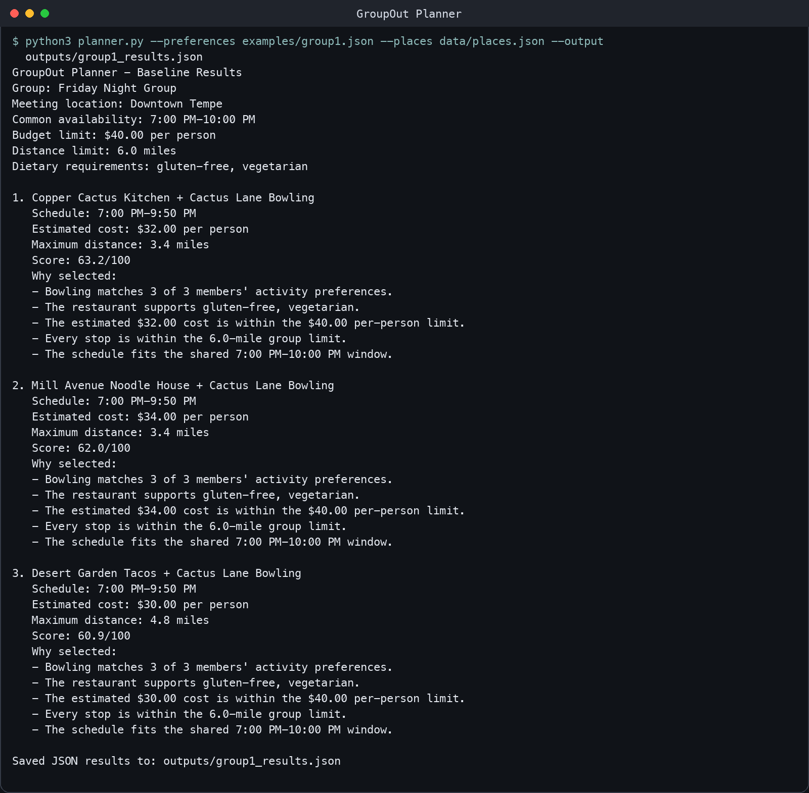
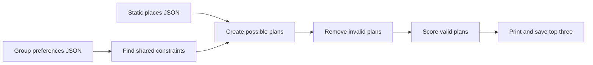

# GroupOut Planner

GroupOut Planner is a small, deterministic baseline that recommends group-night plans from a shared set of constraints. It reads one group's preferences, checks a static set of fictional Tempe restaurants and activities, removes choices that do not work for everyone, and ranks the remaining plans.

This baseline is deliberately simple. It does not call an AI model, use live venue data, make reservations, or require an internet connection. The same input always produces the same output.



## How it works



For each member, the input specifies availability, maximum budget, maximum travel distance, dietary restrictions, and preferred activities. The program uses conservative shared limits so every returned plan works for every member:

- Shared start: the latest start time in the group
- Shared end: the earliest end time in the group
- Budget limit: the lowest individual budget
- Distance limit: the lowest individual distance limit
- Dietary requirements: all restrictions reported by any member

If the group wants food, each candidate contains one restaurant, a fixed 20-minute travel buffer, and one activity. Otherwise, candidates contain one activity.

## Quick start by downloading a ZIP

You do not need Git or programming experience for this method.

1. Open this repository's GitHub page.
2. Click the green **Code** button.
3. Click **Download ZIP**.
4. Open the downloaded ZIP file to extract it.
5. Open the extracted `groupout-planner` folder.
6. Follow the instructions for your operating system below.

## Requirements

- Python 3.10 or newer
- No third-party packages
- No API keys
- No environment variables
- No network connection after downloading the project

Check your Python version:

### macOS or Linux

Open Terminal, type `cd ` including the space, drag the extracted project folder into the Terminal window, and press Return. Then run:

```bash
python3 --version
```

### Windows

Open the extracted project folder in File Explorer. Click the address bar, type `cmd`, and press Enter. Then run:

```powershell
py --version
```

If the version is older than 3.10 or Python is not found, install it from [python.org](https://www.python.org/downloads/) and reopen the terminal.

## Run the included example

Run these commands from the project folder.

### macOS or Linux

```bash
python3 planner.py \
  --preferences examples/group1.json \
  --places data/places.json \
  --output outputs/group1_results.json
```

### Windows PowerShell or Command Prompt

```powershell
py planner.py --preferences examples/group1.json --places data/places.json --output outputs/group1_results.json
```

The recommendations appear in the terminal and are also written to:

```text
outputs/group1_results.json
```

The included example produces this top result:

```text
1. Copper Cactus Kitchen + Cactus Lane Bowling
   Schedule: 7:00 PM-9:50 PM
   Estimated cost: $32.00 per person
   Maximum distance: 3.4 miles
   Score: 63.2/100
```

## Run the tests

The tests use Python's built-in `unittest` module, so there is nothing else to install.

### macOS or Linux

```bash
python3 -m unittest discover -s tests -v
```

### Windows

```powershell
py -m unittest discover -s tests -v
```

A successful run ends with:

```text
Ran 8 tests

OK
```

## Project files

| Location | Purpose |
| --- | --- |
| `planner.py` | Loads inputs, filters plans, ranks results, and provides the command-line interface |
| `examples/group1.json` | Concrete group-preference test case |
| `data/places.json` | Twelve fictional Tempe-area restaurants and activities |
| `outputs/group1_results.json` | Actual output produced by the included test case |
| `tests/test_planner.py` | Automated tests for constraints, filtering, ranking, and errors |
| `docs/baseline-run.png` | Screenshot showing the baseline command and output |

## Preference input reference

The preferences file contains one group and a list of members:

| Field | Type | Meaning |
| --- | --- | --- |
| `group_name` | string | Name used to identify the test group |
| `meeting_location` | string | Reference location for the static distance estimates |
| `wants_food` | boolean | `true` creates restaurant-plus-activity plans; `false` creates activity-only plans |
| `members` | list | One or more member preference objects |
| `available_start` | `HH:MM` string | Earliest time that member can begin, using 24-hour time |
| `available_end` | `HH:MM` string | Latest time that member can finish |
| `max_budget` | number | Maximum estimated cost per person |
| `max_distance_miles` | number | Maximum acceptable distance from the meeting location |
| `dietary_restrictions` | list of strings | Requirements the restaurant must support |
| `preferred_activities` | list of strings | Activity categories preferred by the member |

To try another group, copy `examples/group1.json`, edit the values without changing the field names, and pass the new filename to `--preferences`.

## Filtering and ranking

A plan is removed if it exceeds the shared budget or distance limit, violates a dietary restriction, falls outside a venue's static operating hours, or cannot finish within the shared availability window.

Every remaining plan receives up to 100 points:

| Component | Maximum | Calculation |
| --- | ---: | --- |
| Activity preference | 50 | Fraction of members who selected the activity category |
| Budget headroom | 25 | Larger savings below the group budget receive more points |
| Distance | 15 | Shorter maximum distance receives more points |
| Time-window fit | 10 | Up to 10 points for unused time before the shared end |

The score is a baseline heuristic, not a claim that one plan is objectively best. Equal scores are sorted by plan name so results remain deterministic.

## Troubleshooting

### Python command not found

On macOS or Linux, try `python3`. On Windows, try `py`. Confirm that Python 3.10 or newer is installed and reopen the terminal after installation.

### File not found

Make sure the terminal is open in the folder containing `planner.py`. Run `ls` on macOS/Linux or `dir` on Windows and confirm that `planner.py`, `examples`, and `data` appear.

### Invalid JSON

JSON requires double quotes around text and does not allow a comma after the final list item. The error message reports the line and column that could not be read.

### No feasible plans

This means every possible plan violated at least one shared constraint. Increase the time, budget, or distance limit, relax a dietary requirement, or add compatible places to `data/places.json`.

## Limitations and future work

The places, costs, distances, and hours are fictional static sample data. The program assumes one evening, estimates the distance of each stop from one meeting point, applies equal per-person costs, and does not calculate travel routes or negotiate conflicting preferences.

A future agentic version could ask members for missing information, retrieve live place data through tools, decide which constraints can be relaxed, build multi-stop itineraries, and revise a rejected plan. Those features are intentionally outside this reproducible baseline.
